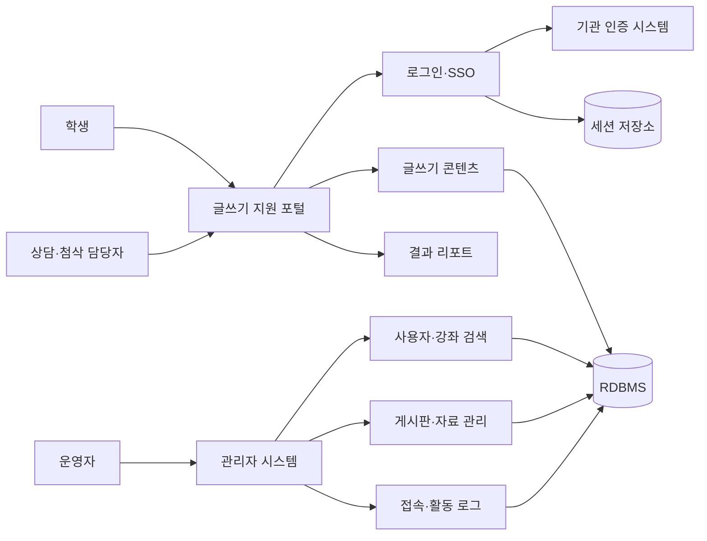

# 대학 글쓰기 지원 플랫폼

학생의 글쓰기 활동과 상담·첨삭 프로그램을 운영하고, 관리자가 사용자·콘텐츠·접속 이력을 관리할 수 있도록 구성한 웹 플랫폼입니다.

여러 교육기관에 적용된 시스템의 로그인·SSO, 운영 로그, 게시판 편집 화면, 사용자·강좌 검색과 결과 리포트 기능을 개발했습니다.

## 시스템 구성

## 내가 개발한 기능

### 기관별 로그인과 SSO 연동

기관마다 다른 인증 방식을 하나의 로그인 흐름에서 처리했습니다. 내부 계정 확인 후 설정에 따라 외부 인증 API 또는 SSO로 연결하고, 인증 결과와 사용자 권한을 기준으로 이동 화면을 결정했습니다.

- 로그인 실패 횟수 확인과 성공 시 초기화
- 학생·교직원·관리자 권한별 진입 화면 분기
- 사용자 정보와 이전 접속 정보를 세션에 구성
- 동일 사용자 중복 세션 확인 및 기존 세션 정리
- 개인정보 동의가 필요한 사용자의 동의 화면 이동
- SSO 로그인과 로그아웃 화면 연동

### 접속 로그와 활동 로그

관리자가 기간과 사용자 조건으로 로그를 조회하고 운영 자료로 내려받을 수 있는 기능을 개발했습니다.

- 접속 로그와 화면·버튼 활동 로그 분리
- 검색 결과 건수 기반 페이징
- 로그인 활동의 요청 데이터에서 사용자 ID 추출
- 조회 조건을 유지한 엑셀 다운로드
- 보존기간 기준 로그 삭제
- 조회·삭제·다운로드 작업 자체도 운영 로그로 기록

### 게시판과 도서 게시판

웹 에디터를 사용하는 등록·수정 화면과 관리자·사용자 화면을 개발했습니다.

- 웹 에디터 초기화와 입력값 처리
- 일반 게시판과 도서 게시판 등록·수정
- 추가 콘텐츠 관리 화면
- 사용자 화면과 관리자 화면의 공통 편집 동작 정리

### 사용자·강좌 검색과 리포트

- 학사 사용자와 일반 사용자를 구분한 검색 팝업
- 글쓰기 프로그램과 연결할 강좌 검색
- 기관별 설정에 따른 결과 리포트 화면
- 메뉴·사이트맵·메인 화면 구성 수정

## 구현 사례

실제 담당 기능의 처리 방식을 Java 17로 다시 작성했습니다. 회사 소스와 운영 설정은 포함하지 않았습니다.

| 담당 기능 | 구현 방식 | 코드 |
|---|---|---|
| 로그인 통합 | 외부 인증 분리, 실패 횟수, 권한 확인, 중복 세션 교체 | [AuthenticationService](samples/operations-core/src/main/java/com/portfolio/writing/auth/AuthenticationService.java) |
| 로그 검색·보존 | 동일 조건 검색/내보내기, 관리자 권한, 보존기간 삭제 | [AuditLogService](samples/operations-core/src/main/java/com/portfolio/writing/audit/AuditLogService.java) |
| 게시글 입력 검증 | 제목·본문·첨부파일 정책을 도메인 규칙으로 분리 | [ContentPolicy](samples/operations-core/src/main/java/com/portfolio/writing/content/ContentPolicy.java) |

자세한 담당 범위는 [기여 내역](docs/CONTRIBUTIONS.md), 처리 순서는 [구현 상세](docs/IMPLEMENTATION.md), 기능과 코드의 연결은 [기능별 구현 근거](docs/FEATURE-MATRIX.md)에 정리했습니다.

## 기술 구성

| 구분 | 사용 기술 | 적용 영역 |
|---|---|---|
| Backend | Java, Spring MVC, 전자정부표준프레임워크 | 인증, 관리자 기능, 업무 처리 |
| Data Access | MyBatis | 사용자, 콘텐츠, 로그 조회 |
| View | JSP, JavaScript, CKEditor | 사용자·관리자 화면과 콘텐츠 편집 |
| Authentication | Session, SSO, 외부 인증 API | 기관별 로그인 연동 |
| Document | 엑셀 템플릿 | 운영 로그와 결과 자료 출력 |
| Build | Maven | 의존성 및 배포 산출물 관리 |

## 추가 설계 문서

- [학사정보 연계용 데이터 모델과 뷰 설계](docs/ACADEMIC-DATA-INTEGRATION.md)

회사 소스, 기관명, 사용자 정보, 인증 주소와 내부 설정은 포함하지 않았습니다. 샘플 코드는 담당 업무를 설명하기 위해 별도로 작성했습니다.
